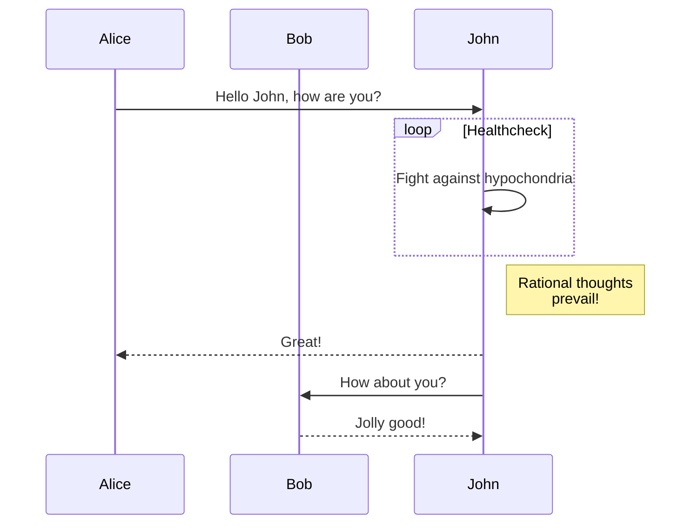
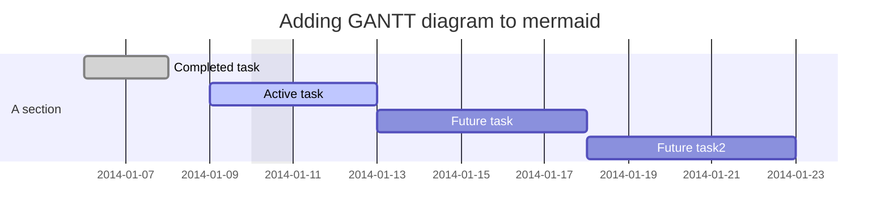
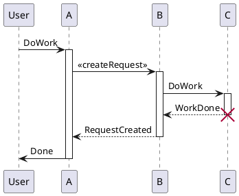
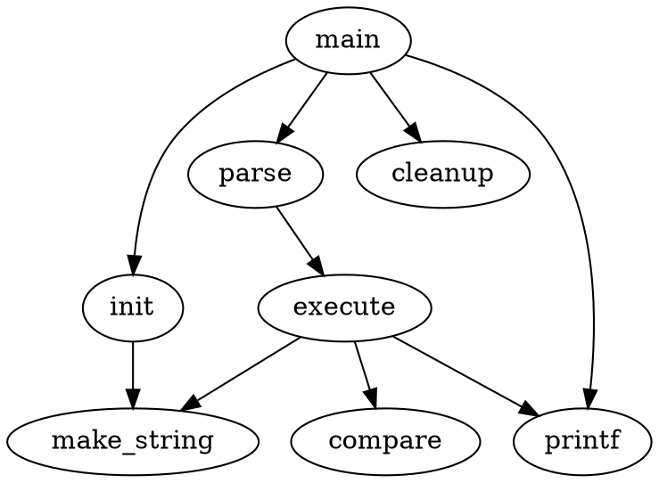

# [TOC]

# [Showdowns Features](https://jhuix.github.io/showdowns)

[Showdowns](https://github.com/jhuix/showdowns) is a lib that make markdown to html with some extensions of showdown.js.
Click the link to preview the [showdowns features](https://jhuix.github.io/showdowns).

Showdowns Markdown Syntax, refer to the document -- [Showdown's Markdown Syntax](https://github.com/showdownjs/showdown/wiki/Showdown's-Markdown-syntax).

- **In browser environment, it is implemented to dynamically load js lib files related to more showdown diagrams extension for using [showdowns >= 0.3.0 version](https://github.com/jhuix/showdowns).**

- **In codeblock of markdown, expanded syntax language attribute from "\```language" to "\```language {json}" or "\```language [json]".**

    - **The common "align" field value of json is "left" or "center" or "right" in syntax language attribute, and it is empty means "left" align.**

    - **The common "codeblock" field value of json is "true" or "false" in syntax language attribute, and it is empty means "false". It is "true" means the codeblock is forced to display as normal code block, otherwise the codeblock is tried to parse as corresponding diagrams.**

    - For example, see following [Network Sequence](#network-sequence) example.

## Table

- The following features are extended based on the showdown's table:

  - Cell spans over columns
  - Cell spans over rows (optional)
  - Omitted table header (optional)

- Showdown's table

cell style syntax has "-{2,}",":-{2,}",":-{2,}:","-{2,}:", means default (align left), align left, align center, and align right style

    | Return Code | Style | Value | DESC      |
    | ----------- | :-----: | :----- | ---------: |
    | OK          | int   | 1     | Succeeded |
    | ERROR       | int   | 0     | Failed '\|'    |

| Return Code | Style | Value | DESC      |
| ----------- | :-----: | :----- | ---------: |
| OK          | int   | 1     | Succeeded |
| ERROR       | int   | 0     | Failed    |

- Colspan table

"||" indicates cells being merged left.

    | Return Code | Style | Value | DESC      |
    | ====== | :-----: | ===== | ===== |
    | **OK**          | int   | 1     | [Succeeded](https://www.baidu.com) |
    | ERROR       | int   | 0     ||
    | ERROR       || 0     ||

| Return Code | Style | Value | DESC      |
| ====== | :-----: | ===== | ===== |
| **OK**          | int   | 1     | [Succeeded](https://www.baidu.com) |
| ERROR       | int   | 0     ||
| ERROR       || 0     ||

- Rowspan table (optional: tablesRowspan)

"^^" indicates cells being merged above.

    | Return Code | Style | Value | DESC      |
    | ====== | :-----: | ===== | ===== |
    | ^^         || 1     | [Succeeded](https://www.baidu.com) |
    | ^^       || 0     ||
    | ERROR       | int   | 0     ||
    | ERROR       || 0     ||
    | ^^       || 0     ||

| Return Code | Style | Value | DESC      |
| ====== | :-----: | ===== | ===== |
| ^^         || 1     | [Succeeded](https://www.baidu.com) |
| ^^       || 0     ||
| ERROR       | int   | 0     ||
| ERROR       || 0     ||
| ^^       || 0     ||

- Headerless table (optional: tablesHeaderless)

Table header can be eliminated.

    |--|--|--|--|--|--|--|--|
    |♜|  |♝|♛|♚|♝|♞|♜|
    |  |♟|♟|♟|  |♟|♟|♟|
    |♟|  |♞|  |  |  |  |  |
    |  |♗|  |  |♟|  |  |  |
    |  |  |  |  |♙|  |  |  |
    |  |  |  |  |  |♘|  |  |
    |♙|♙|♙|♙|  |♙|♙|♙|
    |♖|♘|♗|♕|♔|  |  |♖|

|--|--|--|--|--|--|--|--|
|♜|  |♝|♛|♚|♝|♞|♜|
|  |♟|♟|♟|  |♟|♟|♟|
|♟|  |♞|  |  |  |  |  |
|  |♗|  |  |♟|  |  |  |
|  |  |  |  |♙|  |  |  |
|  |  |  |  |  |♘|  |  |
|♙|♙|♙|♙|  |♙|♙|♙|
|♖|♘|♗|♕|♔|  |  |♖|

## Markdown extension features

### Table of Contents

It's implemented sub-TOC in showdown-toc.js.

#### Markdown Syntax

The syntax string is not case sensitive.

```
[#... ][[|【]Table[ |-]Of[ |-]Contents[】|]]
or
[#... ][[|【]目录[】|]]
or
[#... ][[|【]TOC[】|]]
or
[#... ]{{TOC}}

```

#### sub-TOC examples

#### {{TOC}}

##### sub-TOC examples1

###### sub examples1

##### sub-TOC examples2

###### sub examples2

### Footnotes

It's implemented in showdown-footnotes.js, use for reference the [showdown-footnotes](https://github.com/Kriegslustig/showdown-footnotes).

#### Markdown Syntax

    [^1]: The explanation.

#### Footnotes examples

[^1]: The explanation.

### Container

It's implemented in showdown-container.js, allows you to create block level containers.
By default, The CSS effect with class name tip|info|warning|error|success|alert-tip|alert-info|alert-warning|alert-error|alert-success is implemented. And you can also customize the class name.

#### Markdown Syntax

    ::: <classname | parentclass-childclass> <title content>
    *Some text*
    :::

Which will be rendered as:

    <div class="showdown-container [container classname | parentclass parentclass-childclass]">
      <p class="container-title">title content</p>
      <p>
        <em>Some text</em>
      </p>
    </div>

#### Container examples

::: tip
*A simple tip text!*
:::

::: tip Tip!
*A simple tip text!*
:::

::: info Info!
*A simple info text!*
:::

::: warning Warning!
*A simple warning text!*
:::

::: error Error!
*A simple error text!*
:::

::: success Success!
*A simple success text!*
:::

::: alert-tip
*A simple tip alert text!*
:::

::: alert-tip Alert Tip!
*A simple tip alert text!*
:::

::: alert-info Alert Info!
*A simple info alert text!*
:::

::: alert-warning Alert Warning!
*A simple warning alert text!*
:::

::: alert-error Alert Error!
*A simple error alert text!*
:::

::: alert-success Alert Success!
*A simple success alert text!*
:::

::: alert-success-tip Alert Success Tip!
<style>.alert-success-tip:after {content: '\00a0';width: 0;height: 0;display: block;border-style: solid;border-width: 15px;border-color: #f3961c transparent transparent transparent;position: absolute;z-index: -1;bottom: -30px;left: 50px;}</style>
*A simple success alert text!*
:::

### LaTeX math and AsciiMath

It's supported by [showdown-katex](https://github.com/obedm503/showdown-katex.git), that render [LaTeX](https://www.latex-project.org/) math and [AsciiMath](http://asciimath.org/) using [KaTeX](https://github.com/Khan/KaTeX), You can check [KaTeX supported functions/symbols](https://khan.github.io/KaTeX/function-support.html).

#### Markdown Syntax

* AsciiMath syntax:

  * Block multiple math

    Multiple math are separated by an empty line.

    ````

        ```asciimath {"align": "left | center | right", "codeblock": true | false}
        <code content>
        ```

    ````

  * Inline math

      * `@@...@@` is delimiters of inline ascii math
      * `\\~...\\~` is delimiters of inline block ascii math

* LaTex syntax:

  * Block multiple latex

    Multiple math are separated by an empty line.

    ````
        ```[katex|math|mathjax] {"align": "left | center | right", "codeblock": true | false}
        <code content>
        ```
    ````

  * Inline latex

      * `\\(...\\)` is delimiters of inline latex math
      * `\\[...\\]` is delimiters of inline block latex math
      * `$$...$$` is delimiters of inline block latex math

#### LaTex Math examples

```math
x=\frac{ -b\pm\sqrt{ b^2-4ac } } {2a} \\\\

x=\frac{ -b\pm\sqrt{ b^2-4ac } } {2a} \\\\


x=\frac{ -b\pm\sqrt{ b^2-4ac } } {2a}
```

```katex {align="right"}
x=\frac{ -b\pm\sqrt{ b^2-4ac } } {2a}
```

where:

* \\(\sqrt{ b^2-4ac }\\) is inline latex math
* \\\[\sqrt{ b^2-4ac }\\] is inline latex block math
* $$\sqrt{ b^2-4ac }$$ is inline latex block math

#### AsciiMath examples

Internal heat energy:

```asciimath {"align":"center"}
delta Q = rho \ c \u

delta Q = rho \ c \u
      
delta Q = rho \ c \u


delta Q = rho \ c \u
```

where:

* @@delta Q@@ is the internal heat energy per unit volume \\$(J \* m^-3)\\$

### Code Block Theme

#### Markdown Syntax


````
  ```[js|c|c++|go...] {"theme": "ayu-dark"}
  <code content>
  ```
````

#### Code Block examples

- For JavaScript:


```javascript {theme="github-dark"}
/**
 * Merge object with deepth
 *
 * @param {object} target
 *     Target object
 * @param {object[]} sources
 *     Source object or objects
 * @returns {object}
 *     Meraged Object
 */
export function deepMerge(target, ...sources) {
  for (const source of sources) {
    for (const [key, val] of Object.entries(source)) {
      // @ts-ignore
      if (isObject(val) && isObject(target[key])) {
        // @ts-ignore
        deepMerge(target[key], val)
      } else {
        Object.assign(target, { [key]: val })
      }
    }
  }
  return target
}
```

- For GO:

```go
package utils

import (
	"math"
	"sync"
)

type levelPool struct {
	size int
	pool sync.Pool
}

func newLevelPool(size int) *levelPool {
	return &levelPool{
		size: size,
		pool: sync.Pool{
			New: func() interface{} {
				data := make([]byte, size)
				return &data
			},
		},
	}
}

type LimitedPool struct {
	minSize int
	maxSize int
	pools   []*levelPool
}

func NewLimitedPool(minSize, maxSize int) *LimitedPool {
	if maxSize < minSize {
		panic("maxSize can't be less than minSize")
	}
	const multiplier = 2
	var pools []*levelPool
	curSize := minSize
	for curSize < maxSize {
		pools = append(pools, newLevelPool(curSize))
		curSize *= multiplier
	}
	pools = append(pools, newLevelPool(maxSize))
	return &LimitedPool{
		minSize: minSize,
		maxSize: maxSize,
		pools:   pools,
	}
}

func (p *LimitedPool) findPool(size int) *levelPool {
	if size > p.maxSize {
		return nil
	}
	idx := int(math.Ceil(math.Log2(float64(size) / float64(p.minSize))))
	if idx < 0 {
		idx = 0
	}
	if idx > len(p.pools)-1 {
		return nil
	}
	return p.pools[idx]
}

func (p *LimitedPool) findPutPool(size int) *levelPool {
	if size > p.maxSize {
		return nil
	}
	if size < p.minSize {
		return nil
	}

	idx := int(math.Floor(math.Log2(float64(size) / float64(p.minSize))))
	if idx < 0 {
		idx = 0
	}
	if idx > len(p.pools)-1 {
		return nil
	}
	return p.pools[idx]
}

func (p *LimitedPool) Get(size int) *[]byte {
	sp := p.findPool(size)
	if sp == nil {
		data := make([]byte, size)
		return &data
	}
	buf := sp.pool.Get().(*[]byte)
	*buf = (*buf)[:size]
	return buf
}

func (p *LimitedPool) Put(b *[]byte) {
	sp := p.findPutPool(cap(*b))
	if sp == nil {
		return
	}
	*b = (*b)[:cap(*b)]
	sp.pool.Put(b)
}

```

### Mermaid

It's implemented in showdown-mermaid.js, render diagrams of Flowchart or Sequence or Gantt using [mermaid](https://github.com/knsv/mermaid), check [mermaid doc](https://mermaidjs.github.io) for more information.

#### Markdown Syntax

- Flowchart syntax:

        ```mermaid {"align": "left | center | right", "codeblock": true | false}
        graph TD;
        <code content>
        ```

- Sequence diagram syntax:

        ```mermaid {"align": "left | center | right", "codeblock": true | false}
        sequenceDiagram
        <code content>
        ```

- Gantt diagram syntax:

        ```mermaid {"align": "left | center | right", "codeblock": true | false}
        gantt
        <code content>
        ```

#### Mermaid examples

##### Flowchart


##### Sequence diagram



##### Gantt diagram



### Plantuml

It's implemented in showdown-plantuml.js. render diagrams of uml using [plantuml](http://plantuml.com). To know more about PlantUML, please visit [plantuml website](http://plantuml.com/).

#### Markdown Syntax

    ```plantuml {"align": "left | center | right", "codeblock": true | false}
    @startuml
    <code content>
    @enduml
    ```

#### Plantuml example



### Flowchart

It's implemented in showdown-flowchart.js, render diagrams of flowchart using [flowchart.js](https://github.com/adrai/flowchart.js), check [flowchart website](http://flowchart.js.org/) for more information.

#### Markdown Syntax

    ```flow {"align": "left | center | right", "codeblock": true | false}
    <code content>
    ```

OR

    ```flowchart {"align": "left | center | right", "codeblock": true | false}
    <code content>
    ```

#### Flowchart example

```flow  {"align":"center"}
st=>start: Start:>http://www.google.com[blank]
e=>end:>http://www.google.com
op1=>operation: My Operation
sub1=>subroutine: My Subroutine
cond=>condition: Yes
or No?:>http://www.google.com
io=>inputoutput: catch something...
para=>parallel: parallel tasks

st->op1->cond
cond(yes)->io->e
cond(no)->para
para(path1, bottom)->sub1(right)->op1
para(path2, top)->op1
```

```flowchart {"align":"right"}
st=>start: Start
e=>end
op1=>operation: My Operation
sub1=>subroutine: My Subroutine
cond=>condition: Yes
or No?:>http://www.google.com
io=>inputoutput: catch something
st->op1->cond
cond(yes)->io->e
cond(no)->sub1(right)->op1
```

### Graphviz's dot

It's implemented in showdown-viz.js, render diagrams of graphviz's dot using [viz.js](https://github.com/mdaines/viz.js).

#### Markdown Syntax

The \<engine name> of json's "engine" field value is 'circo', 'dot', 'neato', 'osage', 'twopi' in syntax language attribute.

    ```dot {"engine": "<engine name>", "align": "<align>"}
    <code content>
    ```

#### Graphviz's dot example

- Dot example with dot engine:



<br>

- Dot example with circo engine:


### Railroad diagrams

It's implemented in showdown-viz.js, render diagrams of railroad using [railroad-diagrams](https://github.com/tabatkins/railroad-diagrams).

#### Markdown Syntax

    ```railroad {"align": "left | center | right", "codeblock": true | false}
    <code content>
    ```

#### Railroad diagrams example

```railroad {"align":"center"}
Diagram(
  Optional('+', 'skip'),
    Choice(0,
      NonTerminal('name-start char'),
      NonTerminal('escape')),
      ZeroOrMore(
        Choice(0,
          NonTerminal('name char'),
          NonTerminal('escape'))))
```

### WaveDrom

It's implemented in showdown-viz.js, render diagrams of wavedrom using [wavedrom](https://github.com/wavedrom/wavedrom), check [wavedrom website](https://wavedrom.com) for more information.

#### Markdown Syntax

    ```wavedrom {"align": "left | center | right", "codeblock": true | false}
    <code content>
    ```

#### WaveDrom example

```wavedrom {"align":"center"}
{signal: [
  {name: 'clk', wave: 'p.....|...'},
  {name: 'dat', wave: 'x.345x|=.x', data: ['head', 'body', 'tail', 'data']},
  {name: 'req', wave: '0.1..0|1.0'},
  {},
  {name: 'ack', wave: '1.....|01.'}
]}
```

```wavedrom {"align":"right"}
{ signal: [
  { name: "pclk", wave: 'p.......' },
  { name: "Pclk", wave: 'P.......' },
  { name: "nclk", wave: 'n.......' },
  { name: "Nclk", wave: 'N.......' },
  {},
  { name: 'clk0', wave: 'phnlPHNL' },
  { name: 'clk1', wave: 'xhlhLHl.' },
  { name: 'clk2', wave: 'hpHplnLn' },
  { name: 'clk3', wave: 'nhNhplPl' },
  { name: 'clk4', wave: 'xlh.L.Hx' },
]}
```

### Vega and Vega-Lite

It's implemented in showdown-vega.js, render diagrams of [Vega](https://github.com/vega/vega) and [Vega-Lite](https://github.com/vega/vega-lite) using [vega-embed](https://github.com/vega/vega-embed), check [vega website](https://vega.github.io/vega/) and [vega-lite website](https://vega.github.io/vega-lite) for more information.

#### Markdown Syntax

    ```vega {"align": "left | center | right", "codeblock": true | false}
    <code content>
    ```

OR

    ```vega-lite {"align": "left | center | right", "codeblock": true | false}
    <code content>
    ```

#### Vega and Vega-Lite example

- Vega example:

```vega {"align":"center"}
{
  "$schema": "https://vega.github.io/schema/vega/v6.json",
  "width": 200,
  "height": 200,
  "autosize": "none",

  "signals": [
    {
      "name": "startAngle", "value": 0,
      "bind": {"input": "range", "min": 0, "max": 6.29, "step": 0.01}
    },
    {
      "name": "endAngle", "value": 6.29,
      "bind": {"input": "range", "min": 0, "max": 6.29, "step": 0.01}
    },
    {
      "name": "padAngle", "value": 0,
      "bind": {"input": "range", "min": 0, "max": 0.1}
    },
    {
      "name": "innerRadius", "value": 0,
      "bind": {"input": "range", "min": 0, "max": 90, "step": 1}
    },
    {
      "name": "cornerRadius", "value": 0,
      "bind": {"input": "range", "min": 0, "max": 10, "step": 0.5}
    },
    {
      "name": "sort", "value": false,
      "bind": {"input": "checkbox"}
    }
  ],

  "data": [
    {
      "name": "table",
      "values": [
        {"id": 1, "field": 4},
        {"id": 2, "field": 6},
        {"id": 3, "field": 10},
        {"id": 4, "field": 3},
        {"id": 5, "field": 7},
        {"id": 6, "field": 8}
      ],
      "transform": [
        {
          "type": "pie",
          "field": "field",
          "startAngle": {"signal": "startAngle"},
          "endAngle": {"signal": "endAngle"},
          "sort": {"signal": "sort"}
        }
      ]
    }
  ],

  "scales": [
    {
      "name": "color",
      "type": "ordinal",
      "domain": {"data": "table", "field": "id"},
      "range": {"scheme": "category20"}
    }
  ],

  "marks": [
    {
      "type": "arc",
      "from": {"data": "table"},
      "encode": {
        "enter": {
          "fill": {"scale": "color", "field": "id"},
          "x": {"signal": "width / 2"},
          "y": {"signal": "height / 2"}
        },
        "update": {
          "startAngle": {"field": "startAngle"},
          "endAngle": {"field": "endAngle"},
          "padAngle": {"signal": "padAngle"},
          "innerRadius": {"signal": "innerRadius"},
          "outerRadius": {"signal": "width / 2"},
          "cornerRadius": {"signal": "cornerRadius"}
        }
      }
    }
  ]
}
```

<br>

- Vega-Lite example:

```vega-lite {"align":"right"}
{
  "$schema": "https://vega.github.io/schema/vega-lite/v6.json",
  "description": "Plots two functions using a generated sequence.",
  "width": 300,
  "height": 150,
  "data": {
    "sequence": {
      "start": 0,
      "stop": 12.7,
      "step": 0.1,
      "as": "x"
    }
  },
  "transform": [
    {
      "calculate": "sin(datum.x)",
      "as": "sin(x)"
    },
    {
      "calculate": "cos(datum.x)",
      "as": "cos(x)"
    },
    {
      "fold": ["sin(x)", "cos(x)"]
    }
  ],
  "mark": "line",
  "encoding": {
    "x": {
      "type": "quantitative",
      "field": "x"
    },
    "y": {
      "field": "value",
      "type": "quantitative"
    },
    "color": {
      "field": "key",
      "type": "nominal",
      "title": null
    }
  }
}
```

### Network Sequence

It's implemented in showdown-sequence.js, render diagrams of sequence using [js-sequence-diagrams](https://github.com/bramp/js-sequence-diagrams).

#### Markdown Syntax

The \<theme name> of json's "theme" field value is "hand" or "simple" in syntax language attribute;

    ```sequence {"theme": "<theme name>", "align": "<align>"}
    <code content>
    ```

#### Network Sequence example

- Sequence example with hand theme:

```sequence {"theme":"hand", "align":"center"}
Alice->Bob: Hello Bob, how are you?
Note right of Bob: Bob thinks
Bob-->Alice: I am good thanks!
```

<br>

- Sequence example with simple theme:

```sequence {"theme":"simple", "align":"right"}
Alice->Bob: Hello Bob, how are you?
Note right of Bob: Bob thinks
Bob-->Alice: I am good thanks!
```

### Echarts

#### Markdown Syntax

````
```echarts {"align": "left | center | right", "codeblock": true | false, "width":400, "height":300, "type": "javascript" | "json"}
<code content>
```
````

#### Echarts example

```echarts {"align":"center", "width":640, "height":480}
{
  "title": { "text": "最近 30 天" },
  "tooltip": { "trigger": "axis", "axisPointer": { "lineStyle": { "width": 0 } } },
  "legend": { "data": ["帖子", "用户", "回帖"] },
  "xAxis": [{
      "type": "category",
      "boundaryGap": false,
      "data": ["2019-05-08","2019-05-09","2019-05-10","2019-05-11","2019-05-12","2019-05-13","2019-05-14","2019-05-15","2019-05-16","2019-05-17","2019-05-18","2019-05-19","2019-05-20","2019-05-21","2019-05-22","2019-05-23","2019-05-24","2019-05-25","2019-05-26","2019-05-27","2019-05-28","2019-05-29","2019-05-30","2019-05-31","2019-06-01","2019-06-02","2019-06-03","2019-06-04","2019-06-05","2019-06-06","2019-06-07"],
      "axisTick": { "show": false },
      "axisLine": { "show": false }
  }],
  "yAxis": [{ "type": "value", "axisTick": { "show": false }, "axisLine": { "show": false }, "splitLine": { "lineStyle": { "color": "rgba(0, 0, 0, .38)", "type": "dashed" } } }],
  "series": [
    {
      "name": "帖子", "type": "line", "smooth": true, "itemStyle": { "color": "#d23f31" }, "areaStyle": { "normal": {} }, "z": 3,
      "data": ["18","14","22","9","7","18","10","12","13","16","6","9","15","15","12","15","8","14","9","10","29","22","14","22","9","10","15","9","9","15","0"]
    },
    {
      "name": "用户", "type": "line", "smooth": true, "itemStyle": { "color": "#f1e05a" }, "areaStyle": { "normal": {} }, "z": 2,
      "data": ["31","33","30","23","16","29","23","37","41","29","16","13","39","23","38","136","89","35","22","50","57","47","36","59","14","23","46","44","51","43","0"]
    },
    {
      "name": "回帖", "type": "line", "smooth": true, "itemStyle": { "color": "#4285f4" }, "areaStyle": { "normal": {} }, "z": 1,
      "data": ["35","42","73","15","43","58","55","35","46","87","36","15","44","76","130","73","50","20","21","54","48","73","60","89","26","27","70","63","55","37","0"]
    }
  ]
}
```

```echarts {"align":"center", "width":640, "height":480, "type":"javascript"}
const data = [];
for (let i = 0; i <= 100; i++) {
  let theta = (i / 100) * 360;
  let r = 5 * (1 + Math.sin((theta / 180) * Math.PI));
  data.push([r, theta]);
}
const option = {
  title: {
    text: 'Two Value-Axes in Polar'
  },
  legend: {
    data: ['line']
  },
  polar: {},
  tooltip: {
    trigger: 'axis',
    axisPointer: {
      type: 'cross'
    }
  },
  angleAxis: {
    type: 'value',
    startAngle: 0
  },
  radiusAxis: {},
  series: [
    {
      coordinateSystem: 'polar',
      name: 'line',
      type: 'line',
      data: data
    }
  ]
};
```

### ABC

#### Markdown Syntax

````
```abc {"align": "<align>", "audio": false | true}
<code content>
```
````

#### ABC example

```abc {"width": 640}
T: Cooley's
M: 4/4
Q: 1/4=120
L: 1/8
R: reel
K: Emin
|:{E}D2|EB{c}BA B2 EB|~B2 AB dBAG|FDAD BDAD|FDAD dAFD|
EBBA B2 EB|B2 AB defg|afe^c dBAF|DEFD E2:|
|:gf|eB B2 efge|eB B2 gedB|A2 FA DAFA|A2 FA defg|
eB B2 eBgB|eB B2 defg|afe^c dBAF|DEFD E2:|
```

```abc {"audio": true}
X: 24
T: Clouds Thicken (云层变厚)
C: Paul Rosen
S: Copyright 2005, Paul Rosen
M: 6/8
L: 1/8
Q: 3/8=116
R: Creepy Jig
K: Em
|:"Em"EEE E2G|"C7"_B2A G2F|"Em"EEE E2G|\
"C7"_B2A "B7"=B3|"Em"EEE E2G|
"C7"_B2A G2F|"Em"GFE "D (Bm7)"F2D|\
1"Em"E3-E3:|2"Em"E3-E2B|:"Em"e2e gfe|
"G"g2ab3|"Em"gfeg2e|"D"fedB2A|"Em"e2e gfe|\
"G"g2ab3|"Em"gfe"D"f2d|"Em"e3-e3:|
```
### Kroki

[Support diagram types](https://kroki.io/#support) for BlockDiag (BlockDiag, SeqDiag, ActDiag, NwDiag, PacketDiag, RackDiag), BPMN, Bytefield, C4 (with PlantUML), Diagrams.net (experimental), Ditaa, Erd, Excalidraw, GraphViz, Mermaid, Nomnoml, PlantUML, Structurizr, SvgBob, Symbolator, UMLet, Vega, Vega-Lite, WaveDrom and WireViz…​

#### Markdown Syntax

````
```kroki-[plantuml|blockdiag|...] {"align": "<align>"}
<code content>
```
````

#### Kroki example

##### UML

```kroki-plantuml {"width": 800, "align":"center"}
@startuml
skinparam ranksep 20
skinparam dpi 125
skinparam packageTitleAlignment left

rectangle "Main" {
  (main.view)
  (singleton)
}
rectangle "Base" {
  (base.component)
  (component)
  (model)
}
rectangle "<b>main.ts</b>" as main_ts

(component) ..> (base.component)
main_ts ==> (main.view)
(main.view) --> (component)
(main.view) ...> (singleton)
(singleton) ---> (model)
@enduml
```

##### PacketDiag

```kroki-packetdiag {"width": 800, "align":"center"}
packetdiag {
  colwidth = 32;
  node_height = 72;

  0-15: Source Port;
  16-31: Destination Port;
  32-63: Sequence Number;
  64-95: Acknowledgment Number;
  96-99: Data Offset;
  100-103: Reserved;
  104: CWR [rotate = 270];
  105: ECE [rotate = 270];
  106: URG [rotate = 270];
  107: ACK [rotate = 270];
  108: PSH [rotate = 270];
  109: RST [rotate = 270];
  110: SYN [rotate = 270];
  111: FIN [rotate = 270];
  112-127: Window;
  128-143: Checksum;
  144-159: Urgent Pointer;
  160-191: (Options and Padding);
  192-223: data [colheight = 3];
}
```

##### DBML

```kroki-dbml {"width": 800, "align":"center"}
Table users {
  id integer
  username varchar
  role varchar
  created_at timestamp
}

Table posts {
  id integer [primary key]
  title varchar
  body text [note: 'Content of the post']
  user_id integer
  status post_status
  created_at timestamp
}

Enum post_status {
  draft
  published
  private [note: 'visible via URL only']
}

Ref: posts.user_id > users.id // many-to-one
```

##### BlockDiag

```kroki-blockdiag {"width": 800, "align":"center"}
blockdiag {
  Kroki -> generates -> "Block diagrams";
  Kroki -> is -> "very easy!";

  Kroki [color = "greenyellow"];
  "Block diagrams" [color = "pink"];
  "very easy!" [color = "orange"];
}
```

##### ByteField

```kroki-bytefield {"width": 800, "align":"center"}
(defattrs :bg-green {:fill "#a0ffa0"})
(defattrs :bg-yellow {:fill "#ffffa0"})
(defattrs :bg-pink {:fill "#ffb0a0"})
(defattrs :bg-cyan {:fill "#a0fafa"})
(defattrs :bg-purple {:fill "#e4b5f7"})

(defn draw-group-label-header
  [span label]
  (draw-box (text label [:math {:font-size 12}]) {:span span :borders #{} :height 14}))

(defn draw-remotedb-header
  [kind args]
  (draw-column-headers)
  (draw-group-label-header 5 "start")
  (draw-group-label-header 5 "TxID")
  (draw-group-label-header 3 "type")
  (draw-group-label-header 2 "args")
  (draw-group-label-header 1 "tags")
  (next-row 18)

  (draw-box 0x11 :bg-green)
  (draw-box 0x872349ae [{:span 4} :bg-green])
  (draw-box 0x11 :bg-yellow)
  (draw-box (text "TxID" :math) [{:span 4} :bg-yellow])
  (draw-box 0x10 :bg-pink)
  (draw-box (hex-text kind 4 :bold) [{:span 2} :bg-pink])
  (draw-box 0x0f :bg-cyan)
  (draw-box (hex-text args 2 :bold) :bg-cyan)
  (draw-box 0x14 :bg-purple)

  (draw-box (text "0000000c" :hex [[:plain {:font-weight "light" :font-size 16}] " (12)"]) [{:span 4} :bg-purple])
  (draw-box (hex-text 6 2 :bold) [:box-first :bg-purple])
  (doseq [val [6 6 3 6 6 6 6 3]]
    (draw-box (hex-text val 2 :bold) [:box-related :bg-purple]))
  (doseq [val [0 0]]
    (draw-box val [:box-related :bg-purple]))
  (draw-box 0 [:box-last :bg-purple]))

(draw-remotedb-header 0x4702 9)

(draw-box 0x11)
(draw-box 0x2104 {:span 4})
(draw-box 0x11)
(draw-box 0 {:span 4})
(draw-box 0x11)
(draw-box (text "length" [:math] [:sub 1]) {:span 4})
(draw-box 0x14)

(draw-box (text "length" [:math] [:sub 1]) {:span 4})
(draw-gap "Cue and loop point bytes")

(draw-box nil :box-below)
(draw-box 0x11)
(draw-box 0x36 {:span 4})
(draw-box 0x11)
(draw-box (text "num" [:math] [:sub "hot"]) {:span 4})
(draw-box 0x11)
(draw-box (text "num" [:math] [:sub "cue"]) {:span 4})

(draw-box 0x11)
(draw-box (text "length" [:math] [:sub 2]) {:span 4})
(draw-box 0x14)
(draw-box (text "length" [:math] [:sub 2]) {:span 4})
(draw-gap "Unknown bytes" {:min-label-columns 6})
(draw-bottom)

```

### Tex

Support remote rendering TEX content to SVG code, for example website: [tex.io](https://tex.io).

#### Markdown Syntax

````
```[tex|latex] {"align": "<align>"}
<code content>
```
````

#### Tex example

````
```tex
\documentclass{standalone}
\usepackage{circuitikz}
\begin{document}

\begin{circuitikz}[american, voltage shift=0.5]
\draw (0,0)
to[isource, l=$I_0$, v=$V_0$] (0,3)
to[short, -*, i=$I_0$] (2,3)
to[R=$R_1$, i>_=$i_1$] (2,0) -- (0,0);
\draw (2,3) -- (4,3)
to[R=$R_2$, i>_=$i_2$]
(4,0) to[short, -*] (2,0);
\end{circuitikz}

\end{document}
```
````


```tex
\documentclass{standalone}
\usepackage{circuitikz}
\begin{document}

\begin{circuitikz}[american, voltage shift=0.5]
\draw (0,0)
to[isource, l=$I_0$, v=$V_0$] (0,3)
to[short, -*, i=$I_0$] (2,3)
to[R=$R_1$, i>_=$i_1$] (2,0) -- (0,0);
\draw (2,3) -- (4,3)
to[R=$R_2$, i>_=$i_2$]
(4,0) to[short, -*] (2,0);
\end{circuitikz}

\end{document}
```

````
```tex {"align":"center"}
\documentclass{standalone}
\usepackage{pgfplots}
\pgfplotsset{compat=1.16}

\begin{document}

\begin{tikzpicture}
\begin{axis}[colormap/viridis]
\addplot3[
surf,
samples=18,
domain=-3:3
]
{exp(-x^2-y^2)*x};
\end{axis}
\end{tikzpicture}

\end{document}
```
````


```tex {"align":"center"}
\documentclass{standalone}
\usepackage{pgfplots}
\pgfplotsset{compat=1.16}

\begin{document}

\begin{tikzpicture}
\begin{axis}[colormap/viridis]
\addplot3[
surf,
samples=18,
domain=-3:3
]
{exp(-x^2-y^2)*x};
\end{axis}
\end{tikzpicture}

\end{document}
```
