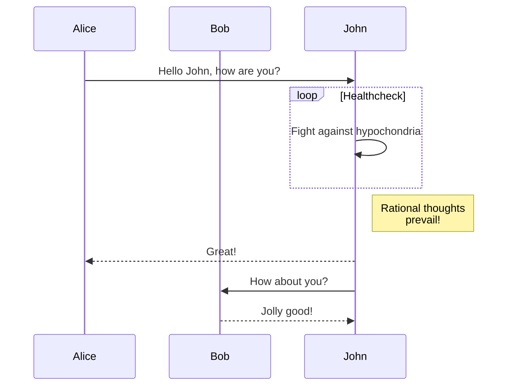
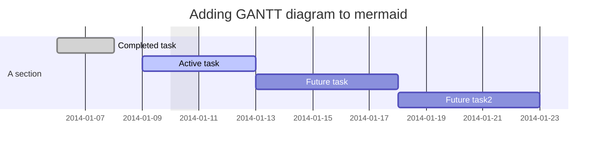
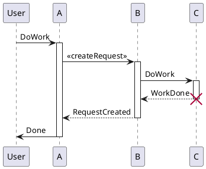
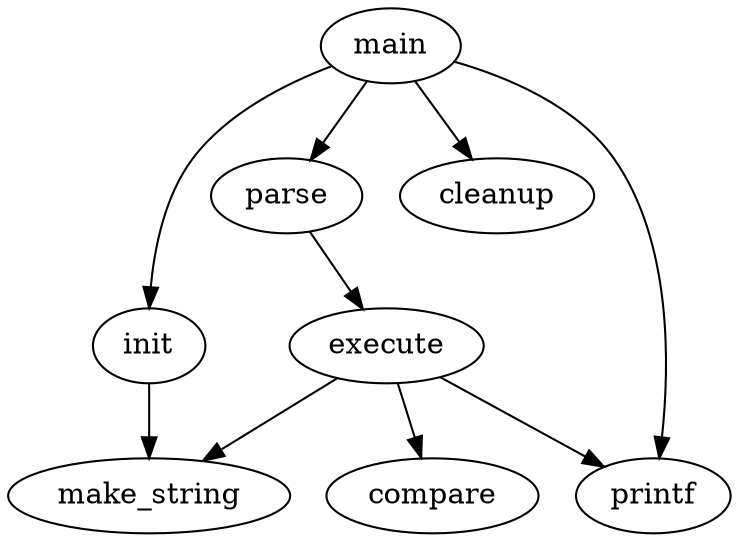

# [TOC]

# [Showdowns Features](https://jhuix.github.io/showdowns)

[Showdowns](https://github.com/jhuix/showdowns) is a lib that make markdown to html with some extensions of showdown.js.
Click the link to preview the [showdowns features](https://jhuix.github.io/showdowns).

Showdowns Markdown Syntax, refer to the document -- [Showdown's Markdown Syntax](https://github.com/showdownjs/showdown/wiki/Showdown's-Markdown-syntax).

- **In browser environment, it is implemented to dynamically load js lib files related to more showdown diagrams extension for using [showdowns >= 0.3.0 version](https://github.com/jhuix/showdowns).**

- **In codeblock of markdown, expanded syntax language attribute from "\```language" to "\```language {json}" or "\```language [json]".**

    - **The common "align" field value of json is "left" or "center" or "right" in syntax language attribute, and it is empty means "left" align.**

    - **The common "codeblock" field value of json is "true" or "false" in syntax language attribute, and it is empty means "false". It is "true" means the codeblock is forced to display as normal code block, otherwise the codeblock is tried to parse as corresponding diagrams.**

    - For example, see following [Network Sequence](#network-sequence) example.

## Table

- The following features are extended based on the showdown's table:

  - Cell spans over columns
  - Cell spans over rows (optional)
  - Omitted table header (optional)

- Showdown's table

cell style syntax has "-{2,}",":-{2,}",":-{2,}:","-{2,}:", means default (align left), align left, align center, and align right style

    | Return Code | Style | Value | DESC      |
    | ----------- | :-----: | :----- | ---------: |
    | OK          | int   | 1     | Succeeded |
    | ERROR       | int   | 0     | Failed '\|'    |

| Return Code | Style | Value | DESC      |
| ----------- | :-----: | :----- | ---------: |
| OK          | int   | 1     | Succeeded |
| ERROR       | int   | 0     | Failed    |

- Colspan table

"||" indicates cells being merged left.

    | Return Code | Style | Value | DESC      |
    | ====== | :-----: | ===== | ===== |
    | **OK**          | int   | 1     | [Succeeded](https://www.baidu.com) |
    | ERROR       | int   | 0     ||
    | ERROR       || 0     ||

| Return Code | Style | Value | DESC      |
| ====== | :-----: | ===== | ===== |
| **OK**          | int   | 1     | [Succeeded](https://www.baidu.com) |
| ERROR       | int   | 0     ||
| ERROR       || 0     ||

- Rowspan table (optional: tablesRowspan)

"^^" indicates cells being merged above.

    | Return Code | Style | Value | DESC      |
    | ====== | :-----: | ===== | ===== |
    | ^^         || 1     | [Succeeded](https://www.baidu.com) |
    | ^^       || 0     ||
    | ERROR       | int   | 0     ||
    | ERROR       || 0     ||
    | ^^       || 0     ||

| Return Code | Style | Value | DESC      |
| ====== | :-----: | ===== | ===== |
| ^^         || 1     | [Succeeded](https://www.baidu.com) |
| ^^       || 0     ||
| ERROR       | int   | 0     ||
| ERROR       || 0     ||
| ^^       || 0     ||

- Headerless table (optional: tablesHeaderless)

Table header can be eliminated.

    |--|--|--|--|--|--|--|--|
    |♜|  |♝|♛|♚|♝|♞|♜|
    |  |♟|♟|♟|  |♟|♟|♟|
    |♟|  |♞|  |  |  |  |  |
    |  |♗|  |  |♟|  |  |  |
    |  |  |  |  |♙|  |  |  |
    |  |  |  |  |  |♘|  |  |
    |♙|♙|♙|♙|  |♙|♙|♙|
    |♖|♘|♗|♕|♔|  |  |♖|

|--|--|--|--|--|--|--|--|
|♜|  |♝|♛|♚|♝|♞|♜|
|  |♟|♟|♟|  |♟|♟|♟|
|♟|  |♞|  |  |  |  |  |
|  |♗|  |  |♟|  |  |  |
|  |  |  |  |♙|  |  |  |
|  |  |  |  |  |♘|  |  |
|♙|♙|♙|♙|  |♙|♙|♙|
|♖|♘|♗|♕|♔|  |  |♖|

## Markdown extension features

### Table of Contents

It's implemented sub-TOC in showdown-toc.js.

#### Markdown Syntax

The syntax string is not case sensitive.

```
[#... ][[|【]Table[ |-]Of[ |-]Contents[】|]]
or
[#... ][[|【]目录[】|]]
or
[#... ][[|【]TOC[】|]]
or
[#... ]{{TOC}}

```

#### sub-TOC examples

#### {{TOC}}

##### sub-TOC examples1

###### sub examples1

##### sub-TOC examples2

###### sub examples2

### Footnotes

It's implemented in showdown-footnotes.js, use for reference the [showdown-footnotes](https://github.com/Kriegslustig/showdown-footnotes).

#### Markdown Syntax

    [^1]: The explanation.

#### Footnotes examples

[^1]: The explanation.

### CSS Defined

Support css be defined. 

#### Markdown Syntax

```

[](css:<css-href>)

OR

<a href="css:<css-href>" />

```

Which will be append a link element to head as:

```

<link rel="stylesheet" href="<css-href>">

```

\<css-href> support format:

    http(s)://jhuix.github.io/showdowns/dist/showdowns.min.css

    file:///i:/showdowns.min.css

    ../dist/showdowns.min.css

#### CSS defined examples

```
[](css:https://jhuix.github.io/showdowns/dist/showdowns.min.css)
```

Which will be append a link element to head as:

```

<link rel="stylesheet" href="https://jhuix.github.io/showdowns/dist/showdowns.min.css">

```

### Inline Image

Support inline image be defined, including the image path can be reset using a reset event.

Its markdown syntax format Its grammatical format is the same as that of obsidian-style image links.

#### Markdown Syntax

```

![[<image path>]]

OR

![[<image path>]]{<image attributes>}


```

Which will be append a image element as:

```

" <image attributes> />

```

#### Inline Image examples

```
![[logo.png]]{ width="64" heigth="64" }
```

Which will be append a image element ![[logo.png]]{ width="64" heigth="64" } as:

```


```

### Directives

It's implemented in showdown-directive.js, allows you to create container directive, leaf directive, text directive.
Generic directives syntax can refer to [generic-directives-plugins-syntax](https://talk.commonmark.org/t/generic-directives-plugins-syntax/444) of commonmark.

#### Container Directives

The special container directive syntax by wrapping text with a set of greater or equal 3 colons or exclamation marks, as seen below:

```
::: name [label] {attributes}
contents, which are sometimes further block elements
:::

OR

!!! name [label] {attributes}
contents, which are sometimes further block elements
!!!
```

The special container directive syntax is classified as [container syntax](#container-syntax) and admonitions syntax. 
But the admonitions syntax also includes [rST-style syntax](#rst-style-syntax) and [compatible syntax](#compatible-syntax).

::css[.colorpicker-color-decoration {
    border: solid .1em #eee;
    box-sizing: border-box;
    margin: .1em .2em 0;
    width: .8em;
    height: .8em;
    line-height: .8em;
    display: inline-block;
}
.dyn-rule-1 {
    background-color: rgb(0,176,255);
}
.dyn-rule-2 {
    background-color: rgb(0,184,212);
}
.dyn-rule-3 {
    background-color: rgb(0,191,165);
}
.dyn-rule-4 {
    background-color: rgb(0,200,83);
}
.dyn-rule-5 {
    background-color: rgb(100,221,23);
}
.dyn-rule-6 {
    background-color: rgb(255,145,0);
}
.dyn-rule-7 {
    background-color: rgb(255,82,82);
}
.dyn-rule-8 {
    background-color: rgb(255,23,68);
}
.dyn-rule-9 {
    background-color: rgb(101,31,255);
}
.dyn-rule-10 {
    background-color: rgb(158, 158, 158);
}
.dyn-rule-11 {
    background-color: rgb(230, 32, 196);
}
.dyn-flag {
  font-family: admons-icons;text-align: center;display: inline-block;width: 100%;
}
.dyn-flag-rule-1 {
  color: rgb(0,176,255);
}
.dyn-flag-rule-2 {
    color: rgb(0,184,212);
}
.dyn-flag-rule-3 {
    color: rgb(0,191,165);
}
.dyn-flag-rule-4 {
    color: rgb(0,200,83);
}
.dyn-flag-rule-5 {
    color: rgb(100,221,23);
}
.dyn-flag-rule-6 {
    color: rgb(255,145,0);
}
.dyn-flag-rule-7 {
    color: rgb(255,82,82);
}
.dyn-flag-rule-8 {
    color: rgb(255,23,68);
}
.dyn-flag-rule-9 {
    color: rgb(101,31,255);
}
.dyn-flag-rule-10 {
    color: rgb(158, 158, 158);
}
.dyn-flag-rule-11 {
    color: rgb(230, 32, 196);
}
]{}

Default the admonitions styles are `note` and `alert` in admonitions syntax. Each style includes the following types, each type corresponds to a class name of css: 

| Type Name | Flag | Color |
| ---- | ----- | ----- |
|`summary`, `tldr`, `概要`, `摘要`| <span class="dyn-flag dyn-flag-rule-1">&#xebbf;</span> | <span class="colorpicker-color-decoration dyn-rule-1"></span>rgb(0,176,255) |
|`abstract`, `抽象`| <span class="dyn-flag dyn-flag-rule-1">&#xe787;</span> | ^^ |
|`info`, `todo`, `信息`, `待办`| <span class="dyn-flag dyn-flag-rule-2">&#xe626;</span> | <span class="colorpicker-color-decoration dyn-rule-2"></span>rgb(0,184,212)|
|`tip`, `hint`, `提示`, `小窍门`| <span class="dyn-flag dyn-flag-rule-3">&#xe60c;</span>| <span class="colorpicker-color-decoration dyn-rule-3"></span>rgb(0,191,165)|
|`success`, `check`, `done`, `成功`, `检测`, `完成`|<span class="dyn-flag dyn-flag-rule-4">&#xe608;</span> | <span class="colorpicker-color-decoration dyn-rule-4"></span>rgb(0,200,83)|
|`question`, `help`, `faq`, `问题`, `帮助`, `问答`| <span class="dyn-flag dyn-flag-rule-5">&#xe606;</span>| <span class="colorpicker-color-decoration dyn-rule-5"></span>rgb(100,221,23)|
|`warning`, `caution`, `警告`, `提醒`| <span class="dyn-flag dyn-flag-rule-6">&#xe62a;</span>| <span class="colorpicker-color-decoration dyn-rule-6"></span>rgb(255,145,0)|
|`attention`, `关注`| <span class="dyn-flag dyn-flag-rule-6">&#xe603;</span>| ^^ |
|`failure`, `fail`, `missing`, `故障`, `失败`, `缺失`| <span class="dyn-flag dyn-flag-rule-7">&#xe609;</span>| <span class="colorpicker-color-decoration dyn-rule-7"></span>rgb(255,82,82)|
|`danger`, `危险`| <span class="dyn-flag dyn-flag-rule-8">&#xe628;</span>| <span class="colorpicker-color-decoration dyn-rule-8"></span>rgb(255,23,68)|
|`error`, `错误`| <span class="dyn-flag dyn-flag-rule-8">&#xe612;</span>|^^|
|`bug`, `缺陷`| <span class="dyn-flag dyn-flag-rule-8">&#xe61f;</span>|^^|
|`example`, `示例`| <span class="dyn-flag dyn-flag-rule-9">&#xe690;</span>| <span class="colorpicker-color-decoration dyn-rule-9"></span>rgb(101,31,255)|
|`snippet`, `片段`| <span class="dyn-flag dyn-flag-rule-9">&#xe8e9;</span>|^^|
|`quote`, `cite`, `引用`, `引文`| <span class="dyn-flag dyn-flag-rule-10">&#xe618;</span>| <span class="colorpicker-color-decoration dyn-rule-10"></span>rgb(158, 158, 158)|
|`important`, `key`, `重点`, `要点`| <span class="dyn-flag dyn-flag-rule-11">&#xe604;</span>| <span class="colorpicker-color-decoration dyn-rule-11"></span>rgb(230, 32, 196)|

And you can also customize the style and type.

##### Container Syntax

Container blocks contain further blocks. The proposed syntax for container block directives is:

```
::: name [label] {#id.x.y attributes}
contents, which are sometimes further block elements
:::

OR

!!! name [label] {#id.x.y attributes}
contents, which are sometimes further block elements
!!!

```
Analogous to fenced code blocks, an arbitrary number of colons or exclamation marks greater or equal three could be used as long as the closing line is longer than the opening line. That way, you can even nest blocks (think divs) by using successively fewer colons for each containing block.

When the name string in the container directive syntax is `container` (also defaults to container when empty string), `row`, or `col`, it is called container syntax, and other strings are called admonitions syntax.

The container syntax, for example:

```
:::::
::::row

:::col-one
!!!tip[tip example]{#example-one.note style="width:100%;"}
one contents, which are sometimes further block elements
!!!
:::

:::col-two
!!! info [info example] {#example-two.alert style="width:100%;"}
two contents, which are sometimes further block elements
!!!
:::

::::
:::::

```

Which will be rendered as:

```
<div class="container">
  <div class="container-content">
    <div class="row">
      <div class="row-content">
        <div class="col one">
          <div class="col-content">
            <div id="example-one" class="admonition note tip" style="width:100%;">
              <div class="admonition-title">tip example</div>
              <div class="admonition-content">
                <p>one contents, which are sometimes further block elements</p>
              </div>
            </div>
          </div>
        </div>
        <div class="col two">
          <div class="col-content">
            <div id="example-two" class="admonition alert info" style="width:100%;">
              <div class="admonition-title">info example</div>
              <div class="admonition-content">
                <p>two contents, which are sometimes further block elements</p>
              </div>
            </div>
          </div>
        </div>
      </div>
    </div>
  </div>
</div>
```

The admonitions of container syntax, for example:

```
::: tip [tip example] {#example.alert style="width:100%;"}
contents, which are sometimes further block elements
:::

OR

!!! tip [tip example] {#example.alert style="width:100%;"}
contents, which are sometimes further block elements
!!!
```

Which will be rendered as:

```
<div id="example" class="admonition alert tip" style="width:100%;">
  <div class="admonition-title">
    <p>tip example</p>
  </div>
  <div class="admonition-content">
    <p>You should info that the title will be automatically capitalized.</p>
  </div>
</div>
```

##### rST-style Syntax

Admonitions of [rST-style](https://docutils.sourceforge.io/docs/ref/rst/directives.html#specific-admonitions) are created using the following syntax:

```
!!! types "optional explicit title within double quotes"
    Any number of other indented markdown elements.

    This is the second paragraph.
```

type will be used as the CSS class name and as default title. It must be a single word. So, for instance:

```
!!! note info
    You should type name(info) or style name(note) that the title will be automatically capitalized.
```

will render:

```
<div class="admonition note info">
  <div class="admonition-title">
    <p>info</p>
  </div>
  <div class="admonition-content">
    <p>You should info that the title will be automatically capitalized.</p>
  </div>
</div>
```

##### Compatible Syntax

A compatible admonitions syntax by wrapping text with a set of greater or equal 3 colons, as seen below:

```
::: <name | name0-name1-...> <label>
*Some text*
:::
```

Which will be rendered as:

```
<div class=`admonition [name | name0 name1 ...]`>
  <div class=`admonition-title`>
    <p>label</p>
  </div>
  <div class=`admonition-content`>
    <p>
      <em>Some text</em>
    </p>
  </div>
</div>
```

##### Container Example

For [note](#note-style) and [alert](#alert-style) style examples.

###### Note Style

:::::
!!!key[key]{.note}
Some **content** with *Markdown* `syntax`. Check [this `api`](#).
!!!

!!! note info "info"
    Some **content** with *Markdown* `syntax`. Check [this `api`](#).

::::row
:::col

!!!key[key]{.note}
Some **content** with *Markdown* `syntax`. Check [this `api`](#).
!!!

!!!cite[cite]{.note}
Some **content** with __Markdown__ `syntax`. Check [this `api`](#).
!!!

!!!snippet[snippet]{.note}
Some **content** with _Markdown_ `syntax`. Check [this `api`](#).
!!!

!!!hint[hint]{.note}
Some **content** with _Markdown_ `syntax`. Check [this `api`](#).
!!!

!!!todo[todo]{.note}
Some **content** with _Markdown_ `syntax`. Check [this `api`](#).
!!!

:::


:::col

!!!important[important]{.note}
Some **content** with _Markdown_ `syntax`. Check [this `api`](#).
!!!

!!!quote[quote]{.note}
Some **content** with _Markdown_ `syntax`. Check [this `api`](#).
!!!

!!!example[example]{.note}
Some **content** with _Markdown_ `syntax`. Check [this `api`](#).
!!!

!!!tip[tip]{.note}
Some **content** with _Markdown_ `syntax`. Check [this `api`](#).
!!!

!!!info[info]{.note}
Some **content** with _Markdown_ `syntax`. Check [this `api`](#).
!!!

:::
::::

::::row
:::col

!!!bug[bug]{.note}
Some **content** with _Markdown_ `syntax`. Check [this `api`](#).
!!!


!!!missing[missing]{.note}
Some **content** with _Markdown_ `syntax`. Check [this `api`](#).
!!!

!!!caution[caution]{.note}
Some **content** with _Markdown_ `syntax`. Check [this `api`](#).
!!!

!!!faq[faq]{.note}
Some **content** with _Markdown_ `syntax`. Check [this `api`](#).
!!!

!!!done[done]{.note}
Some **content** with _Markdown_ `syntax`. Check [this `api`](#).
!!!

!!!tldr[tldr]{.note}
Some **content** with _Markdown_ `syntax`. Check [this `api`](#).
!!!

:::

:::col

!!!error[error]{.note}
Some **content** with _Markdown_ `syntax`. Check [this `api`](#).
!!!


!!!fail[fail]{.note}
Some **content** with _Markdown_ `syntax`. Check [this `api`](#).
!!!

!!!attention[attention]{.note}
Some **content** with _Markdown_ `syntax`. Check [this `api`](#).
!!!

!!!help[help]{.note}
Some **content** with _Markdown_ `syntax`. Check [this `api`](#).
!!!

!!!check[check]{.note}
Some **content** with _Markdown_ `syntax`. Check [this `api`](#).
!!!

!!!abstract[abstract]{.note}
Some **content** with _Markdown_ `syntax`. Check [this `api`](#).
!!!

:::

:::col

!!!danger[danger]{.note}
Some **content** with _Markdown_ `syntax`. Check [this `api`](#).
!!!

!!!failure[failure]{.note}
Some **content** with _Markdown_ `syntax`. Check [this `api`](#).
!!!

!!!warning[warning]{.note}
Some **content** with _Markdown_ `syntax`. Check [this `api`](#).
!!!

!!!question[question]{.note}
Some **content** with _Markdown_ `syntax`. Check [this `api`](#).
!!!

!!!success[success]{.note}
Some **content** with _Markdown_ `syntax`. Check [this `api`](#).
!!!

!!!summary[summary]{.note}
Some **content** with _Markdown_ `syntax`. Check [this `api`](#).
!!!

:::

::::
:::::

###### Alert Style

:::::

!!!key[key]{.alert}
Some **content** with *Markdown* `syntax`. Check [this `api`](#).
!!!

!!! alert info "info"
    Some **content** with *Markdown* `syntax`. Check [this `api`](#).

::::row
:::col

!!!key[key]{.alert}
Some **content** with _Markdown_ `syntax`. Check [this `api`](#).
!!!

!!!cite[cite]{.alert}
Some **content** with _Markdown_ `syntax`. Check [this `api`](#).
!!!

!!!snippet[snippet]{.alert}
Some **content** with _Markdown_ `syntax`. Check [this `api`](#).
!!!

!!!hint[hint]{.alert}
Some **content** with _Markdown_ `syntax`. Check [this `api`](#).
!!!

!!!todo[todo]{.alert}
Some **content** with _Markdown_ `syntax`. Check [this `api`](#).
!!!

:::


:::col

!!!important[important]{.alert}
Some **content** with _Markdown_ `syntax`. Check [this `api`](#).
!!!

!!!quote[quote]{.alert}
Some **content** with _Markdown_ `syntax`. Check [this `api`](#).
!!!

!!!example[example]{.alert}
Some **content** with _Markdown_ `syntax`. Check [this `api`](#).
!!!

!!!tip[tip]{.alert}
Some **content** with _Markdown_ `syntax`. Check [this `api`](#).
!!!

!!!info[info]{.alert}
Some **content** with _Markdown_ `syntax`. Check [this `api`](#).
!!!

:::
::::

::::row
:::col

!!!bug[bug]{.alert}
Some **content** with _Markdown_ `syntax`. Check [this `api`](#).
!!!


!!!missing[missing]{.alert}
Some **content** with _Markdown_ `syntax`. Check [this `api`](#).
!!!

!!!caution[caution]{.alert}
Some **content** with _Markdown_ `syntax`. Check [this `api`](#).
!!!

!!!faq[faq]{.alert}
Some **content** with _Markdown_ `syntax`. Check [this `api`](#).
!!!

!!!done[done]{.alert}
Some **content** with _Markdown_ `syntax`. Check [this `api`](#).
!!!

!!!tldr[tldr]{.alert}
Some **content** with _Markdown_ `syntax`. Check [this `api`](#).
!!!

:::

:::col

!!!error[error]{.alert}
Some **content** with _Markdown_ `syntax`. Check [this `api`](#).
!!!


!!!fail[fail]{.alert}
Some **content** with _Markdown_ `syntax`. Check [this `api`](#).
!!!

!!!attention[attention]{.alert}
Some **content** with _Markdown_ `syntax`. Check [this `api`](#).
!!!

!!!help[help]{.alert}
Some **content** with _Markdown_ `syntax`. Check [this `api`](#).
!!!

!!!check[check]{.alert}
Some **content** with _Markdown_ `syntax`. Check [this `api`](#).
!!!

!!!abstract[abstract]{.alert}
Some **content** with _Markdown_ `syntax`. Check [this `api`](#).
!!!

:::

:::col

!!!danger[danger]{.alert}
Some **content** with _Markdown_ `syntax`. Check [this `api`](#).
!!!

!!!failure[failure]{.alert}
Some **content** with _Markdown_ `syntax`. Check [this `api`](#).
!!!

!!!warning[warning]{.alert}
Some **content** with _Markdown_ `syntax`. Check [this `api`](#).
!!!

!!!question[question]{.alert}
Some **content** with _Markdown_ `syntax`. Check [this `api`](#).
!!!

!!!success[success]{.alert}
Some **content** with _Markdown_ `syntax`. Check [this `api`](#).
!!!

!!!summary[summary]{.alert}
Some **content** with _Markdown_ `syntax`. Check [this `api`](#).
!!!

:::

::::
:::::

#### Leaf Directives

The syntax for leaf block directives:

```
:: name [title | content] {#id.x.y attributes(key=val)}
```

To be recognized as a directive, this has to form an otherwise empty paragraph. But as opposed to [text directives](#text-directives), there are two colons now, the brackets [] are optional as well, and spaces may be interspersed for readability.

Leaf blocks are defined by default in three types: `media` or `video` or `媒体` or `音视频`, `css-link`, and `css`. See the table below for details:

| Type Name | [title \| content] | {attributes} | Rendered content |
| --------- | -- | -- | ---------------- |
|`media`,`video`,`媒体`,`音视频`| optional `title` | `src` attribute | \<iframe id="id" class="x y" src="...">\<div class="media-title">title\</div>\</iframe> |
|`css-link`| free | `href` attribute | \<link id="id" class="x y" href="..."> |
|`css`| css content | free | \<style id="id" key=val>content\</style> |

And you can also customize the type that can be triggered by event `leafDirective` to output custom HTML code.

#### Text Directives

The syntax for text directives, it is also an inline directives:

```
:name[content]{#id.x.y attributes(key=val)}
```

Exactly one colon, followed by the name which is the identifier for the extension and must be a string without spaces, content may be further inline markdown elements to be interpreted and then printed in one way or another and the {#myId.myClass key=val key2="val 2"} contain generic attributes (i.e. key-value pairs) and are optional.

Rendered by default as:

```
<name id="id" class="x y" key=val>content</name>
```

And you can also customize the type that can be triggered by event `textDirective` to customize and reset default HTML code.

### LaTeX math and AsciiMath

It's supported by [showdown-katex](https://github.com/obedm503/showdown-katex.git), that render [LaTeX](https://www.latex-project.org/) math and [AsciiMath](http://asciimath.org/) using [KaTeX](https://github.com/Khan/KaTeX), You can check [KaTeX supported functions/symbols](https://khan.github.io/KaTeX/function-support.html).

#### Markdown Syntax

* AsciiMath syntax:

  * Block multiple math

    Multiple math are separated by an empty line.

    ````

        ```asciimath {"align": "left | center | right", "codeblock": true | false}
        <code content>
        ```

    ````

  * Inline math

      * `@@...@@` is delimiters of inline ascii math
      * `\\~...\\~` is delimiters of inline block ascii math

* LaTex syntax:

  * Block multiple latex

    Multiple math are separated by an empty line.

    ````
        ```[katex|math|mathjax] {"align": "left | center | right", "codeblock": true | false}
        <code content>
        ```
    ````

  * Inline latex

      * `\\(...\\)` is delimiters of inline latex math
      * `\\[...\\]` is delimiters of inline block latex math
      * `$$...$$` is delimiters of inline block latex math

#### LaTex Math examples

```math
x=\frac{ -b\pm\sqrt{ b^2-4ac } } {2a} \\\\

x=\frac{ -b\pm\sqrt{ b^2-4ac } } {2a} \\\\


x=\frac{ -b\pm\sqrt{ b^2-4ac } } {2a}
```

```katex {align="right"}
x=\frac{ -b\pm\sqrt{ b^2-4ac } } {2a}
```

where:

* \\(\sqrt{ b^2-4ac }\\) is inline latex math
* \\\[\sqrt{ b^2-4ac }\\] is inline latex block math
* $$\sqrt{ b^2-4ac }$$ is inline latex block math

#### AsciiMath examples

Internal heat energy:

```asciimath {"align":"center"}
delta Q = rho \ c \u

delta Q = rho \ c \u
      
delta Q = rho \ c \u


delta Q = rho \ c \u
```

where:

* @@delta Q@@ is the internal heat energy per unit volume \\$(J \* m^-3)\\$

### Code Block Theme

#### Markdown Syntax


````
  ```[js|c|c++|go...] {"theme": "ayu-dark"}
  <code content>
  ```
````

#### Code Block examples

- For JavaScript:


```javascript {theme="github-dark"}
/**
 * Merge object with deepth
 *
 * @param {object} target
 *     Target object
 * @param {object[]} sources
 *     Source object or objects
 * @returns {object}
 *     Meraged Object
 */
export function deepMerge(target, ...sources) {
  for (const source of sources) {
    for (const [key, val] of Object.entries(source)) {
      // @ts-ignore
      if (isObject(val) && isObject(target[key])) {
        // @ts-ignore
        deepMerge(target[key], val)
      } else {
        Object.assign(target, { [key]: val })
      }
    }
  }
  return target
}
```

- For GO:

```go
package utils

import (
	"math"
	"sync"
)

type levelPool struct {
	size int
	pool sync.Pool
}

func newLevelPool(size int) *levelPool {
	return &levelPool{
		size: size,
		pool: sync.Pool{
			New: func() interface{} {
				data := make([]byte, size)
				return &data
			},
		},
	}
}

type LimitedPool struct {
	minSize int
	maxSize int
	pools   []*levelPool
}

func NewLimitedPool(minSize, maxSize int) *LimitedPool {
	if maxSize < minSize {
		panic("maxSize can't be less than minSize")
	}
	const multiplier = 2
	var pools []*levelPool
	curSize := minSize
	for curSize < maxSize {
		pools = append(pools, newLevelPool(curSize))
		curSize *= multiplier
	}
	pools = append(pools, newLevelPool(maxSize))
	return &LimitedPool{
		minSize: minSize,
		maxSize: maxSize,
		pools:   pools,
	}
}

func (p *LimitedPool) findPool(size int) *levelPool {
	if size > p.maxSize {
		return nil
	}
	idx := int(math.Ceil(math.Log2(float64(size) / float64(p.minSize))))
	if idx < 0 {
		idx = 0
	}
	if idx > len(p.pools)-1 {
		return nil
	}
	return p.pools[idx]
}

func (p *LimitedPool) findPutPool(size int) *levelPool {
	if size > p.maxSize {
		return nil
	}
	if size < p.minSize {
		return nil
	}

	idx := int(math.Floor(math.Log2(float64(size) / float64(p.minSize))))
	if idx < 0 {
		idx = 0
	}
	if idx > len(p.pools)-1 {
		return nil
	}
	return p.pools[idx]
}

func (p *LimitedPool) Get(size int) *[]byte {
	sp := p.findPool(size)
	if sp == nil {
		data := make([]byte, size)
		return &data
	}
	buf := sp.pool.Get().(*[]byte)
	*buf = (*buf)[:size]
	return buf
}

func (p *LimitedPool) Put(b *[]byte) {
	sp := p.findPutPool(cap(*b))
	if sp == nil {
		return
	}
	*b = (*b)[:cap(*b)]
	sp.pool.Put(b)
}

```

### Mermaid

It's implemented in showdown-mermaid.js, render diagrams of Flowchart or Sequence or Gantt using [mermaid](https://github.com/knsv/mermaid), check [mermaid doc](https://mermaidjs.github.io) for more information.

#### Markdown Syntax

- Flowchart syntax:

        ```mermaid {"align": "left | center | right", "codeblock": true | false}
        graph TD;
        <code content>
        ```

- Sequence diagram syntax:

        ```mermaid {"align": "left | center | right", "codeblock": true | false}
        sequenceDiagram
        <code content>
        ```

- Gantt diagram syntax:

        ```mermaid {"align": "left | center | right", "codeblock": true | false}
        gantt
        <code content>
        ```

#### Mermaid examples

##### Flowchart


##### Sequence diagram



##### Gantt diagram



### Plantuml

It's implemented in showdown-plantuml.js. render diagrams of uml using [plantuml](http://plantuml.com). To know more about PlantUML, please visit [plantuml website](http://plantuml.com/).

#### Markdown Syntax

    ```plantuml {"align": "left | center | right", "codeblock": true | false}
    @startuml
    <code content>
    @enduml
    ```

#### Plantuml example



### Flowchart

It's implemented in showdown-flowchart.js, render diagrams of flowchart using [flowchart.js](https://github.com/adrai/flowchart.js), check [flowchart website](http://flowchart.js.org/) for more information.

#### Markdown Syntax

    ```flow {"align": "left | center | right", "codeblock": true | false}
    <code content>
    ```

OR

    ```flowchart {"align": "left | center | right", "codeblock": true | false}
    <code content>
    ```

#### Flowchart example

```flow  {"align":"center"}
st=>start: Start:>http://www.google.com[blank]
e=>end:>http://www.google.com
op1=>operation: My Operation
sub1=>subroutine: My Subroutine
cond=>condition: Yes
or No?:>http://www.google.com
io=>inputoutput: catch something...
para=>parallel: parallel tasks

st->op1->cond
cond(yes)->io->e
cond(no)->para
para(path1, bottom)->sub1(right)->op1
para(path2, top)->op1
```

```flowchart {"align":"right"}
st=>start: Start
e=>end
op1=>operation: My Operation
sub1=>subroutine: My Subroutine
cond=>condition: Yes
or No?:>http://www.google.com
io=>inputoutput: catch something
st->op1->cond
cond(yes)->io->e
cond(no)->sub1(right)->op1
```

### Graphviz's dot

It's implemented in showdown-viz.js, render diagrams of graphviz's dot using [viz.js](https://github.com/mdaines/viz.js).

#### Markdown Syntax

The \<engine name> of json's "engine" field value is 'circo', 'dot', 'neato', 'osage', 'twopi' in syntax language attribute.

    ```dot {"engine": "<engine name>", "align": "<align>"}
    <code content>
    ```

#### Graphviz's dot example

- Dot example with dot engine:



<br>

- Dot example with circo engine:


### Railroad diagrams

It's implemented in showdown-viz.js, render diagrams of railroad using [railroad-diagrams](https://github.com/tabatkins/railroad-diagrams).

#### Markdown Syntax

    ```railroad {"align": "left | center | right", "codeblock": true | false}
    <code content>
    ```

#### Railroad diagrams example

```railroad {"align":"center"}
Diagram(
  Optional('+', 'skip'),
    Choice(0,
      NonTerminal('name-start char'),
      NonTerminal('escape')),
      ZeroOrMore(
        Choice(0,
          NonTerminal('name char'),
          NonTerminal('escape'))))
```

### WaveDrom

It's implemented in showdown-viz.js, render diagrams of wavedrom using [wavedrom](https://github.com/wavedrom/wavedrom), check [wavedrom website](https://wavedrom.com) for more information.

#### Markdown Syntax

    ```wavedrom {"align": "left | center | right", "codeblock": true | false}
    <code content>
    ```

#### WaveDrom example

```wavedrom {"align":"center"}
{signal: [
  {name: 'clk', wave: 'p.....|...'},
  {name: 'dat', wave: 'x.345x|=.x', data: ['head', 'body', 'tail', 'data']},
  {name: 'req', wave: '0.1..0|1.0'},
  {},
  {name: 'ack', wave: '1.....|01.'}
]}
```

```wavedrom {"align":"right"}
{ signal: [
  { name: "pclk", wave: 'p.......' },
  { name: "Pclk", wave: 'P.......' },
  { name: "nclk", wave: 'n.......' },
  { name: "Nclk", wave: 'N.......' },
  {},
  { name: 'clk0', wave: 'phnlPHNL' },
  { name: 'clk1', wave: 'xhlhLHl.' },
  { name: 'clk2', wave: 'hpHplnLn' },
  { name: 'clk3', wave: 'nhNhplPl' },
  { name: 'clk4', wave: 'xlh.L.Hx' },
]}
```

### Vega and Vega-Lite

It's implemented in showdown-vega.js, render diagrams of [Vega](https://github.com/vega/vega) and [Vega-Lite](https://github.com/vega/vega-lite) using [vega-embed](https://github.com/vega/vega-embed), check [vega website](https://vega.github.io/vega/) and [vega-lite website](https://vega.github.io/vega-lite) for more information.

#### Markdown Syntax

    ```vega {"align": "left | center | right", "codeblock": true | false}
    <code content>
    ```

OR

    ```vega-lite {"align": "left | center | right", "codeblock": true | false}
    <code content>
    ```

#### Vega and Vega-Lite example

- Vega example:

```vega {"align":"center"}
{
  "$schema": "https://vega.github.io/schema/vega/v6.json",
  "width": 200,
  "height": 200,
  "autosize": "none",

  "signals": [
    {
      "name": "startAngle", "value": 0,
      "bind": {"input": "range", "min": 0, "max": 6.29, "step": 0.01}
    },
    {
      "name": "endAngle", "value": 6.29,
      "bind": {"input": "range", "min": 0, "max": 6.29, "step": 0.01}
    },
    {
      "name": "padAngle", "value": 0,
      "bind": {"input": "range", "min": 0, "max": 0.1}
    },
    {
      "name": "innerRadius", "value": 0,
      "bind": {"input": "range", "min": 0, "max": 90, "step": 1}
    },
    {
      "name": "cornerRadius", "value": 0,
      "bind": {"input": "range", "min": 0, "max": 10, "step": 0.5}
    },
    {
      "name": "sort", "value": false,
      "bind": {"input": "checkbox"}
    }
  ],

  "data": [
    {
      "name": "table",
      "values": [
        {"id": 1, "field": 4},
        {"id": 2, "field": 6},
        {"id": 3, "field": 10},
        {"id": 4, "field": 3},
        {"id": 5, "field": 7},
        {"id": 6, "field": 8}
      ],
      "transform": [
        {
          "type": "pie",
          "field": "field",
          "startAngle": {"signal": "startAngle"},
          "endAngle": {"signal": "endAngle"},
          "sort": {"signal": "sort"}
        }
      ]
    }
  ],

  "scales": [
    {
      "name": "color",
      "type": "ordinal",
      "domain": {"data": "table", "field": "id"},
      "range": {"scheme": "category20"}
    }
  ],

  "marks": [
    {
      "type": "arc",
      "from": {"data": "table"},
      "encode": {
        "enter": {
          "fill": {"scale": "color", "field": "id"},
          "x": {"signal": "width / 2"},
          "y": {"signal": "height / 2"}
        },
        "update": {
          "startAngle": {"field": "startAngle"},
          "endAngle": {"field": "endAngle"},
          "padAngle": {"signal": "padAngle"},
          "innerRadius": {"signal": "innerRadius"},
          "outerRadius": {"signal": "width / 2"},
          "cornerRadius": {"signal": "cornerRadius"}
        }
      }
    }
  ]
}
```

<br>

- Vega-Lite example:

```vega-lite {"align":"right"}
{
  "$schema": "https://vega.github.io/schema/vega-lite/v6.json",
  "description": "Plots two functions using a generated sequence.",
  "width": 300,
  "height": 150,
  "data": {
    "sequence": {
      "start": 0,
      "stop": 12.7,
      "step": 0.1,
      "as": "x"
    }
  },
  "transform": [
    {
      "calculate": "sin(datum.x)",
      "as": "sin(x)"
    },
    {
      "calculate": "cos(datum.x)",
      "as": "cos(x)"
    },
    {
      "fold": ["sin(x)", "cos(x)"]
    }
  ],
  "mark": "line",
  "encoding": {
    "x": {
      "type": "quantitative",
      "field": "x"
    },
    "y": {
      "field": "value",
      "type": "quantitative"
    },
    "color": {
      "field": "key",
      "type": "nominal",
      "title": null
    }
  }
}
```

### Network Sequence

It's implemented in showdown-sequence.js, render diagrams of sequence using [js-sequence-diagrams](https://github.com/bramp/js-sequence-diagrams).

#### Markdown Syntax

The \<theme name> of json's "theme" field value is "hand" or "simple" in syntax language attribute;

    ```sequence {"theme": "<theme name>", "align": "<align>"}
    <code content>
    ```

#### Network Sequence example

- Sequence example with hand theme:

```sequence {"theme":"hand", "align":"center"}
Alice->Bob: Hello Bob, how are you?
Note right of Bob: Bob thinks
Bob-->Alice: I am good thanks!
```

<br>

- Sequence example with simple theme:

```sequence {"theme":"simple", "align":"right"}
Alice->Bob: Hello Bob, how are you?
Note right of Bob: Bob thinks
Bob-->Alice: I am good thanks!
```

### Echarts

#### Markdown Syntax

````
```echarts {"align": "left | center | right", "codeblock": true | false, "width":400, "height":300, "type": "javascript" | "json"}
<code content>
```
````

#### Echarts example

```echarts {"align":"center", "width":640, "height":480}
{
  "title": { "text": "最近 30 天" },
  "tooltip": { "trigger": "axis", "axisPointer": { "lineStyle": { "width": 0 } } },
  "legend": { "data": ["帖子", "用户", "回帖"] },
  "xAxis": [{
      "type": "category",
      "boundaryGap": false,
      "data": ["2019-05-08","2019-05-09","2019-05-10","2019-05-11","2019-05-12","2019-05-13","2019-05-14","2019-05-15","2019-05-16","2019-05-17","2019-05-18","2019-05-19","2019-05-20","2019-05-21","2019-05-22","2019-05-23","2019-05-24","2019-05-25","2019-05-26","2019-05-27","2019-05-28","2019-05-29","2019-05-30","2019-05-31","2019-06-01","2019-06-02","2019-06-03","2019-06-04","2019-06-05","2019-06-06","2019-06-07"],
      "axisTick": { "show": false },
      "axisLine": { "show": false }
  }],
  "yAxis": [{ "type": "value", "axisTick": { "show": false }, "axisLine": { "show": false }, "splitLine": { "lineStyle": { "color": "rgba(0, 0, 0, .38)", "type": "dashed" } } }],
  "series": [
    {
      "name": "帖子", "type": "line", "smooth": true, "itemStyle": { "color": "#d23f31" }, "areaStyle": { "normal": {} }, "z": 3,
      "data": ["18","14","22","9","7","18","10","12","13","16","6","9","15","15","12","15","8","14","9","10","29","22","14","22","9","10","15","9","9","15","0"]
    },
    {
      "name": "用户", "type": "line", "smooth": true, "itemStyle": { "color": "#f1e05a" }, "areaStyle": { "normal": {} }, "z": 2,
      "data": ["31","33","30","23","16","29","23","37","41","29","16","13","39","23","38","136","89","35","22","50","57","47","36","59","14","23","46","44","51","43","0"]
    },
    {
      "name": "回帖", "type": "line", "smooth": true, "itemStyle": { "color": "#4285f4" }, "areaStyle": { "normal": {} }, "z": 1,
      "data": ["35","42","73","15","43","58","55","35","46","87","36","15","44","76","130","73","50","20","21","54","48","73","60","89","26","27","70","63","55","37","0"]
    }
  ]
}
```

```echarts {"align":"center", "width":640, "height":480, "type":"javascript"}
const data = [];
for (let i = 0; i <= 100; i++) {
  let theta = (i / 100) * 360;
  let r = 5 * (1 + Math.sin((theta / 180) * Math.PI));
  data.push([r, theta]);
}
const option = {
  title: {
    text: 'Two Value-Axes in Polar'
  },
  legend: {
    data: ['line']
  },
  polar: {},
  tooltip: {
    trigger: 'axis',
    axisPointer: {
      type: 'cross'
    }
  },
  angleAxis: {
    type: 'value',
    startAngle: 0
  },
  radiusAxis: {},
  series: [
    {
      coordinateSystem: 'polar',
      name: 'line',
      type: 'line',
      data: data
    }
  ]
};
```

### ABC

#### Markdown Syntax

````
```abc {"align": "<align>", "audio": false | true}
<code content>
```
````

#### ABC example

```abc {"width": 640}
T: Cooley's
M: 4/4
Q: 1/4=120
L: 1/8
R: reel
K: Emin
|:{E}D2|EB{c}BA B2 EB|~B2 AB dBAG|FDAD BDAD|FDAD dAFD|
EBBA B2 EB|B2 AB defg|afe^c dBAF|DEFD E2:|
|:gf|eB B2 efge|eB B2 gedB|A2 FA DAFA|A2 FA defg|
eB B2 eBgB|eB B2 defg|afe^c dBAF|DEFD E2:|
```

```abc {"audio": true}
X: 24
T: Clouds Thicken (云层变厚)
C: Paul Rosen
S: Copyright 2005, Paul Rosen
M: 6/8
L: 1/8
Q: 3/8=116
R: Creepy Jig
K: Em
|:"Em"EEE E2G|"C7"_B2A G2F|"Em"EEE E2G|\
"C7"_B2A "B7"=B3|"Em"EEE E2G|
"C7"_B2A G2F|"Em"GFE "D (Bm7)"F2D|\
1"Em"E3-E3:|2"Em"E3-E2B|:"Em"e2e gfe|
"G"g2ab3|"Em"gfeg2e|"D"fedB2A|"Em"e2e gfe|\
"G"g2ab3|"Em"gfe"D"f2d|"Em"e3-e3:|
```
### Kroki

[Support diagram types](https://kroki.io/#support) for BlockDiag (BlockDiag, SeqDiag, ActDiag, NwDiag, PacketDiag, RackDiag), BPMN, Bytefield, C4 (with PlantUML), Diagrams.net (experimental), Ditaa, Erd, Excalidraw, GraphViz, Mermaid, Nomnoml, PlantUML, Structurizr, SvgBob, Symbolator, UMLet, Vega, Vega-Lite, WaveDrom and WireViz…​

#### Markdown Syntax

````
```kroki-[plantuml|blockdiag|...] {"align": "<align>"}
<code content>
```
````

#### Kroki example

##### UML

```kroki-plantuml {"width": 800, "align":"center"}
@startuml
skinparam ranksep 20
skinparam dpi 125
skinparam packageTitleAlignment left

rectangle "Main" {
  (main.view)
  (singleton)
}
rectangle "Base" {
  (base.component)
  (component)
  (model)
}
rectangle "<b>main.ts</b>" as main_ts

(component) ..> (base.component)
main_ts ==> (main.view)
(main.view) --> (component)
(main.view) ...> (singleton)
(singleton) ---> (model)
@enduml
```

##### PacketDiag

```kroki-packetdiag {"width": 800, "align":"center"}
packetdiag {
  colwidth = 32;
  node_height = 72;

  0-15: Source Port;
  16-31: Destination Port;
  32-63: Sequence Number;
  64-95: Acknowledgment Number;
  96-99: Data Offset;
  100-103: Reserved;
  104: CWR [rotate = 270];
  105: ECE [rotate = 270];
  106: URG [rotate = 270];
  107: ACK [rotate = 270];
  108: PSH [rotate = 270];
  109: RST [rotate = 270];
  110: SYN [rotate = 270];
  111: FIN [rotate = 270];
  112-127: Window;
  128-143: Checksum;
  144-159: Urgent Pointer;
  160-191: (Options and Padding);
  192-223: data [colheight = 3];
}
```

##### DBML

```kroki-dbml {"width": 800, "align":"center"}
Table users {
  id integer
  username varchar
  role varchar
  created_at timestamp
}

Table posts {
  id integer [primary key]
  title varchar
  body text [note: 'Content of the post']
  user_id integer
  status post_status
  created_at timestamp
}

Enum post_status {
  draft
  published
  private [note: 'visible via URL only']
}

Ref: posts.user_id > users.id // many-to-one
```

##### BlockDiag

```kroki-blockdiag {"width": 800, "align":"center"}
blockdiag {
  Kroki -> generates -> "Block diagrams";
  Kroki -> is -> "very easy!";

  Kroki [color = "greenyellow"];
  "Block diagrams" [color = "pink"];
  "very easy!" [color = "orange"];
}
```

##### ByteField

```kroki-bytefield {"width": 800, "align":"center"}
(defattrs :bg-green {:fill "#a0ffa0"})
(defattrs :bg-yellow {:fill "#ffffa0"})
(defattrs :bg-pink {:fill "#ffb0a0"})
(defattrs :bg-cyan {:fill "#a0fafa"})
(defattrs :bg-purple {:fill "#e4b5f7"})

(defn draw-group-label-header
  [span label]
  (draw-box (text label [:math {:font-size 12}]) {:span span :borders #{} :height 14}))

(defn draw-remotedb-header
  [kind args]
  (draw-column-headers)
  (draw-group-label-header 5 "start")
  (draw-group-label-header 5 "TxID")
  (draw-group-label-header 3 "type")
  (draw-group-label-header 2 "args")
  (draw-group-label-header 1 "tags")
  (next-row 18)

  (draw-box 0x11 :bg-green)
  (draw-box 0x872349ae [{:span 4} :bg-green])
  (draw-box 0x11 :bg-yellow)
  (draw-box (text "TxID" :math) [{:span 4} :bg-yellow])
  (draw-box 0x10 :bg-pink)
  (draw-box (hex-text kind 4 :bold) [{:span 2} :bg-pink])
  (draw-box 0x0f :bg-cyan)
  (draw-box (hex-text args 2 :bold) :bg-cyan)
  (draw-box 0x14 :bg-purple)

  (draw-box (text "0000000c" :hex [[:plain {:font-weight "light" :font-size 16}] " (12)"]) [{:span 4} :bg-purple])
  (draw-box (hex-text 6 2 :bold) [:box-first :bg-purple])
  (doseq [val [6 6 3 6 6 6 6 3]]
    (draw-box (hex-text val 2 :bold) [:box-related :bg-purple]))
  (doseq [val [0 0]]
    (draw-box val [:box-related :bg-purple]))
  (draw-box 0 [:box-last :bg-purple]))

(draw-remotedb-header 0x4702 9)

(draw-box 0x11)
(draw-box 0x2104 {:span 4})
(draw-box 0x11)
(draw-box 0 {:span 4})
(draw-box 0x11)
(draw-box (text "length" [:math] [:sub 1]) {:span 4})
(draw-box 0x14)

(draw-box (text "length" [:math] [:sub 1]) {:span 4})
(draw-gap "Cue and loop point bytes")

(draw-box nil :box-below)
(draw-box 0x11)
(draw-box 0x36 {:span 4})
(draw-box 0x11)
(draw-box (text "num" [:math] [:sub "hot"]) {:span 4})
(draw-box 0x11)
(draw-box (text "num" [:math] [:sub "cue"]) {:span 4})

(draw-box 0x11)
(draw-box (text "length" [:math] [:sub 2]) {:span 4})
(draw-box 0x14)
(draw-box (text "length" [:math] [:sub 2]) {:span 4})
(draw-gap "Unknown bytes" {:min-label-columns 6})
(draw-bottom)

```

### Tex

Support remote rendering TEX content to SVG code, for example website: [tex.io](https://tex.io).

#### Markdown Syntax

````
```[tex|latex] {"align": "<align>"}
<code content>
```
````

#### Tex example

````
```tex
\documentclass{standalone}
\usepackage{circuitikz}
\begin{document}

\begin{circuitikz}[american, voltage shift=0.5]
\draw (0,0)
to[isource, l=$I_0$, v=$V_0$] (0,3)
to[short, -*, i=$I_0$] (2,3)
to[R=$R_1$, i>_=$i_1$] (2,0) -- (0,0);
\draw (2,3) -- (4,3)
to[R=$R_2$, i>_=$i_2$]
(4,0) to[short, -*] (2,0);
\end{circuitikz}

\end{document}
```
````


```tex
\documentclass{standalone}
\usepackage{circuitikz}
\begin{document}

\begin{circuitikz}[american, voltage shift=0.5]
\draw (0,0)
to[isource, l=$I_0$, v=$V_0$] (0,3)
to[short, -*, i=$I_0$] (2,3)
to[R=$R_1$, i>_=$i_1$] (2,0) -- (0,0);
\draw (2,3) -- (4,3)
to[R=$R_2$, i>_=$i_2$]
(4,0) to[short, -*] (2,0);
\end{circuitikz}

\end{document}
```

````
```tex {"align":"center"}
\documentclass{standalone}
\usepackage{pgfplots}
\pgfplotsset{compat=1.16}

\begin{document}

\begin{tikzpicture}
\begin{axis}[colormap/viridis]
\addplot3[
surf,
samples=18,
domain=-3:3
]
{exp(-x^2-y^2)*x};
\end{axis}
\end{tikzpicture}

\end{document}
```
````


```tex {"align":"center"}
\documentclass{standalone}
\usepackage{pgfplots}
\pgfplotsset{compat=1.16}

\begin{document}

\begin{tikzpicture}
\begin{axis}[colormap/viridis]
\addplot3[
surf,
samples=18,
domain=-3:3
]
{exp(-x^2-y^2)*x};
\end{axis}
\end{tikzpicture}

\end{document}
```

### Plotly

Support svg for plotly, for example website: [plotly.com](https://plotly.com/javascript/).
The 'it' in code is current element.

#### Markdown Syntax

````
```plotly {"align": "<align>"}
<code content>
```
````

#### Plotly example

````
```plotly

var n = 100;
var x = [], y = [], z = [];
var dt = 0.015;

for (i = 0; i < n; i++) {
  x[i] = Math.random() * 2 - 1;
  y[i] = Math.random() * 2 - 1;
  z[i] = 30 + Math.random() * 10;
}

Plotly.newPlot(it, [{
  x: x,
  y: z,
  mode: 'markers'
}], {
  xaxis: {range: [-40, 40]},
  yaxis: {range: [0, 60]},
  autosize: true
})

function compute () {
  var s = 10, b = 8/3, r = 28;
  var dx, dy, dz;
  var xh, yh, zh;
  for (var i = 0; i < n; i++) {
    dx = s * (y[i] - x[i]);
    dy = x[i] * (r - z[i]) - y[i];
    dz = x[i] * y[i] - b * z[i];

    xh = x[i] + dx * dt * 0.5;
    yh = y[i] + dy * dt * 0.5;
    zh = z[i] + dz * dt * 0.5;

    dx = s * (yh - xh);
    dy = xh * (r - zh) - yh;
    dz = xh * yh - b * zh;

    x[i] += dx * dt;
    y[i] += dy * dt;
    z[i] += dz * dt;
  }
}

function update () {
  compute();

  Plotly.animate(it, {
    data: [{x: x, y: z}]
  }, {
    transition: {
      duration: 0
    },
    frame: {
      duration: 0,
      redraw: false
    }
  });

  requestAnimationFrame(update);
}

requestAnimationFrame(update);

```
````

```plotly

var n = 100;
var x = [], y = [], z = [];
var dt = 0.015;

for (i = 0; i < n; i++) {
  x[i] = Math.random() * 2 - 1;
  y[i] = Math.random() * 2 - 1;
  z[i] = 30 + Math.random() * 10;
}

Plotly.newPlot(it, [{
  x: x,
  y: z,
  mode: 'markers'
}], {
  xaxis: {range: [-40, 40]},
  yaxis: {range: [0, 60]},
  autosize: true
})

function compute () {
  var s = 10, b = 8/3, r = 28;
  var dx, dy, dz;
  var xh, yh, zh;
  for (var i = 0; i < n; i++) {
    dx = s * (y[i] - x[i]);
    dy = x[i] * (r - z[i]) - y[i];
    dz = x[i] * y[i] - b * z[i];

    xh = x[i] + dx * dt * 0.5;
    yh = y[i] + dy * dt * 0.5;
    zh = z[i] + dz * dt * 0.5;

    dx = s * (yh - xh);
    dy = xh * (r - zh) - yh;
    dz = xh * yh - b * zh;

    x[i] += dx * dt;
    y[i] += dy * dt;
    z[i] += dz * dt;
  }
}

function update () {
  compute();

  Plotly.animate(it, {
    data: [{x: x, y: z}]
  }, {
    transition: {
      duration: 0
    },
    frame: {
      duration: 0,
      redraw: false
    }
  });

  requestAnimationFrame(update);
}

requestAnimationFrame(update);

```

### Gnuplot

Support local render svg for gnuplot, for example website: [Gnuplot](http://www.gnuplot.info/).

#### Markdown Syntax

````
```gnuplot {"align": "<align>"}
<code content>
```
````

#### Gnuplot example


````
```gnuplot
#
# Compare surface drawn "with pm3d" colored with a 7-color discrete palette
# to the same surface drawn "with contourfill" 
#

set colorbox user origin 0.75,0.2 size 0.15, 0.6
set cbtics scale .1
set view ,,,1.2
unset key

set xrange [-8:8]
set yrange [-8:8]

set rmargin at screen 0.75
set xyplane 0
set isosamples 51
set samples 51

set pm3d border lt -1 lw 0.5
set pm3d depth

sinc(x) = (x==0) ? 1.0 : sin(x) / x
f(x,y) = sinc( sqrt(x*x + y*y) )

set label 1 "set palette cubehelix\nmaxcolors 7"
set label 1 at screen 0.825, 0.9 center
set palette cubehelix maxcolors 7

set label 2 at screen 0.4, 0.9 center
set label 2 "set contourfill cbtics\nsplot with contourfill"
set contourfill cbtics

splot f(x,y) with contourfill fs border lc "black" lw 0.5
```
````

```gnuplot
#
# Compare surface drawn "with pm3d" colored with a 7-color discrete palette
# to the same surface drawn "with contourfill" 
#

set colorbox user origin 0.75,0.2 size 0.15, 0.6
set cbtics scale .1
set view ,,,1.2
unset key

set xrange [-8:8]
set yrange [-8:8]

set rmargin at screen 0.75
set xyplane 0
set isosamples 51
set samples 51

set pm3d border lt -1 lw 0.5
set pm3d depth

sinc(x) = (x==0) ? 1.0 : sin(x) / x
f(x,y) = sinc( sqrt(x*x + y*y) )

set label 1 "set palette cubehelix\nmaxcolors 7"
set label 1 at screen 0.825, 0.9 center
set palette cubehelix maxcolors 7

set label 2 at screen 0.4, 0.9 center
set label 2 "set contourfill cbtics\nsplot with contourfill"
set contourfill cbtics

splot f(x,y) with contourfill fs border lc "black" lw 0.5
```

### AntV Infographic

Support rendering svg of [AntV Infographic](https://github.com/antvis/Infographic).

[AntV Infographic](https://github.com/antvis/Infographic) is AntV's next-generation declarative infographic visualization engine. With a carefully designed infographic syntax, it can quickly and flexibly render high-quality infographics, making information presentation more efficient and data storytelling simpler.

Infographic options see [InfographicOptions](https://infographic.antv.vision/reference/infographic-options).

#### Markdown Syntax

````
```infographic {"align": "<align>", “options": "<InfographicOptions>"}
<code content>
```
````

#### AntV Infographic example

````
```infographic

infographic list-row-simple-horizontal-arrow
data
  lists
    - label Step 1
      desc Start
    - label Step 2
      desc In Progress
    - label Step 3
      desc Complete


```
````

```infographic

infographic list-row-simple-horizontal-arrow
data
  lists
    - label Step 1
      desc Start
    - label Step 2
      desc In Progress
    - label Step 3
      desc Complete


```

### ZenUML

Support rendering svg of [ZenUML](https://github.com/mermaid-js/zenuml-core).

[ZenUML](https://github.com/mermaid-js/zenuml-core). is a family of diagramming tools operated by P&D Vision Pty Ltd. It works on Atlassian Confluence, any modern browser, JetBrains Intellij IDE. It is featured as a leading diagram-as-code solution for sequence diagrams. Extra capabilities are provided on different platforms.

ZenUML language guide see [Language Guide](https://zenuml.com/docs/category/language-guide/).

ZenUML options see [ZenumlOptions](https://github.com/mermaid-js/zenuml-core/blob/main/TUTORIAL.md#configuration).

#### Markdown Syntax

````
```zenuml {"align": "<align>", “options": "<ZenumlOptions>"}
<code content>
```
````

#### ZenUML example

```zenuml
A B C D

A->B.method() {
  ret0_assign_rtl =C.method_long_to_give_space {
    @return C->D: ret1_annotation_ltr
    ret5_assign_ltr = B.method
    if(x) {
      ret0_assign_rtl =C.method_long_to_give_space {
        @return C->D: ret1_annotation_ltr
        ret5_assign_ltr = B.method
      }
    }
    B.method2 {
      return ret2_return_ltr
    }
  }

  return ret2_return_rtl
  @return B->A: ret4_annotation_rtl
}
```


```zenuml { "options": {"theme":"theme-woolworths"} }
// An example for a RESTful endpoint<br>
// Go to the "Cheat sheet" tab or https://docs.zenuml.com
// to find all syntax<br>
// `POST /v1/book/{id}/borrow`
BookLibService.Borrow(id) {
  User = Session.GetUser()
  if(User.isActive) {
    try {
      BookRepository.Update(id, onLoan, User)
      receipt = new Receipt(id, dueDate)
    } catch (BookNotFoundException) {
      ErrorService.onException(BookNotFoundException)
    } finally {
      Connection.close()
    }
  }
  return receipt
}
```
